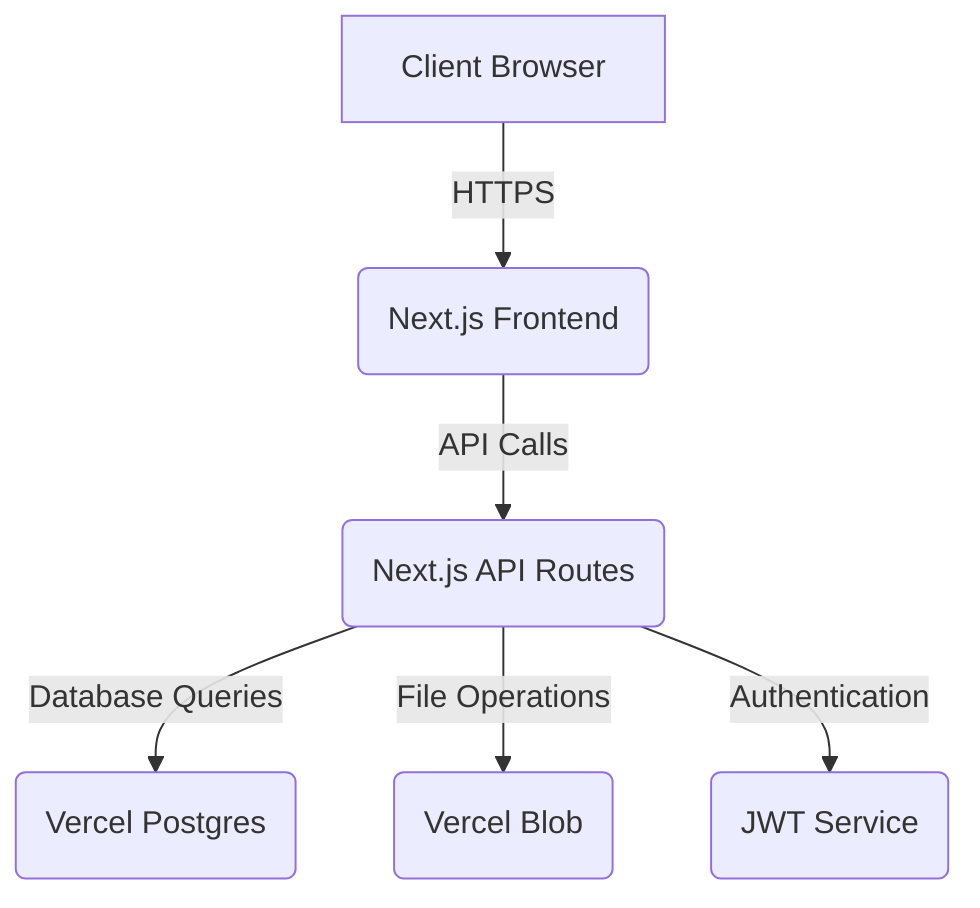

# FlowDash - Architecture

## 🏗️ **System Architecture**
FlowDash is a modern web application built on a serverless architecture, leveraging the Next.js framework for both the frontend and backend. The application is designed to be deployed on Vercel, taking advantage of its serverless functions for API endpoints and integration with Vercel Postgres for the database and Vercel Blob for file storage.

## 📂 **Source Code Paths**
- **`src/app`**: Contains the main application code, following the Next.js App Router structure.
  - **`src/app/api`**: Houses all the API endpoints for the application, organized by feature.
  - **`src/app/(pages)/[lng]`**: Contains all language-aware pages.
    - **`src/app/(pages)/[lng]/dashboard`**: Contains the pages for the main user dashboard.
- **`src/components`**: Reusable React components used throughout the application.
  - **`src/components/layout`**: Components related to the overall page structure, like headers and sidebars.
  - **`src/components/__tests__`**: Tests for the components.
- **`src/lib`**: Core libraries and utility functions.
  - **`src/lib/auth.ts`**: Authentication-related functions.
  - **`src/lib/db.ts`**: Database connection and query logic.
  - **`src/lib/migrations`**: SQL files for database schema migrations.
- **`src/schemas`**: Zod schemas for data validation, organized by data model.
- **`src/context`**: React context providers for global state management (e.g., authentication, language).
- **`src/hooks`**: Custom React hooks for reusable logic.
- **`src/theme`**: Chakra UI theme configuration.
- **`src/types`**: TypeScript type definitions.
- **`public`**: Static assets, including images, fonts, and translation files.
  - **`src/app/i18n/locales`**: Translation files for internationalization.

## 🔑 **Key Technical Decisions**
- **Next.js App Router**: Chosen for its server-side rendering capabilities, improved performance, and simplified routing.
- **Serverless Functions**: API endpoints are deployed as serverless functions on Vercel, providing scalability and cost-effectiveness.
- **Vercel Postgres**: A serverless PostgreSQL database that integrates seamlessly with Vercel deployments.
- **Chakra UI**: A component library that provides a set of accessible, reusable, and composable React components to speed up development.
- **JWT for Authentication**: JSON Web Tokens are used for securing the API and managing user sessions. The `AuthContext` handles the post-login redirect logic to prevent race conditions.
- **Zod for Validation**: Zod is used for schema validation on both the client and server sides, ensuring data integrity.
- **i18next for Internationalization**: `i18next` and `react-i18next` are used to handle translations in a way that is compatible with the Next.js App Router. This includes language-based routing using a dynamic `[lng]` segment in the URL. The `middleware.ts` file is the single source of truth for synchronizing the language cookie with the URL. Translation keys are organized into logical namespaces (e.g., `common`, `products`) to improve maintainability. The JSON translation files have a flat structure with keys at the root level. A comprehensive translation audit has been completed to ensure all translations are simplified from technical jargon to everyday language, making the application accessible to factory workers with limited technical literacy. The application supports English, Hindi, and Gujarati languages for the Indian factory market.
- **Theme Configuration**: Chakra UI theme is configured in `src/theme/theme.ts`. Custom Button variants were removed to allow proper colorScheme functionality, ensuring destructive actions appear red, positive actions appear green, and primary actions appear blue.

## 🎨 **Design Patterns**
- **MVC (Model-View-Controller)**: The application loosely follows the MVC pattern, with the Next.js pages/components acting as the View, the API routes as the Controller, and the database/schemas as the Model.
- **Repository Pattern**: The database logic is abstracted away from the API routes using a repository pattern, making the code more modular and easier to test.
- **Provider Pattern**: React's Context API is used to manage global state, such as authentication and language preferences.

## 🔗 **Component Relationships**
- The main application is wrapped in a `Providers` component that provides the necessary context for authentication, UI theme, and internationalization.
- The `WithAuth` higher-order component is used to protect routes that require authentication.
- The dashboard pages are composed of smaller, reusable components for managing products, users, and inventory logs.
- The `AppInitializer` component handles the initial application state, including checking for an existing user session.
- The `GlobalSpinner` component provides a global loading state for the application.

## 🗃️ **Database Schema**
The database schema is designed to support a multi-tenant architecture, with each organization's data isolated. The main tables include:
- **`organizations`**: Stores information about each factory.
- **`users`**: Manages user accounts, roles, and their association with an organization.
- **`products`**: Contains the product catalog for each organization.
- **`inventory_logs`**: Tracks production data logged by floor staff.
- **`inventory`**: Provides a real-time summary of stock levels.
- **`product_attributes`**: Stores reusable attributes for products.

## 🔒 **Security Considerations**
- **SQL Injection Prevention**: The `/api/distinct/{entity}/{field}` endpoint uses whitelisting to prevent SQL injection attacks. Only pre-approved entity names and fields are allowed.
- **JWT Authentication**: Secure httpOnly cookies are used for token storage, protecting against XSS attacks.
- **Role-Based Access Control**: Strict hierarchy enforced - super_admin can create admin/floor_staff, admin can only create floor_staff.
- **Input Validation**: Zod schemas validate all inputs on both client and server sides. Enhanced username validation includes length restrictions (3-20 characters), character validation (letters, numbers, dots, underscores, hyphens only), format rules (no leading/trailing/consecutive special characters), and reserved words blocking. Case-insensitive uniqueness checks prevent username conflicts within organizations.

## 🎨 **UI/UX Design Patterns**
- **Button Color Coding**: Consistent color scheme for user actions:
  - Red: Destructive actions (delete, archive, logout)
  - Green: Positive actions (save, reactivate)
  - Blue: Primary actions (login, add, update)
  - Default: Neutral actions (edit, cancel)
- **Mobile-First Design**: Responsive layouts with accordion-style mobile interfaces for complex tables.
- **Accessibility**: WCAG-compliant design with proper ARIA labels and keyboard navigation.